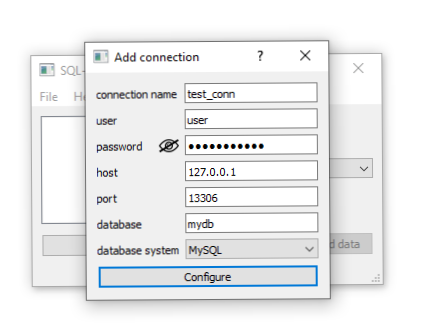
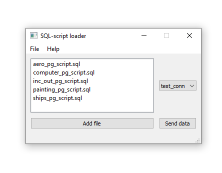

### A simple GUI application such as sql*loader for working with PostgreSQL and MySQL

### For running application:
 * [Python 3.8.6](https://www.python.org/downloads/release/python-386/)
 * [PyQt5](https://pypi.org/project/PyQt5/)
 * [mysql-connector-python](https://pypi.org/project/mysql-connector-python/)
 * [psycopg2](https://pypi.org/project/psycopg2/)
### Screenshots
 
 
